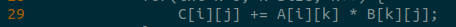

# Exercise 1 - Java Profiling

``$ srun --partition=cpar /share/apps7/java/jdk-17.0.2/bin/javac``

## a)
``$ srun --partition=cpar /share/apps7/java/jdk-17.0.2/bin/java -XX:+PrintCompilation MULT``

A *mmult* foi compilada 8 vezes

## b)
O código executado é a linha 29 que é Multiplicação de Matrizes

# Anexos

 |**Pergunta 1 a**|
 |:-----:|
 ||

 |**Pergunta 1 b Perf Report**|
 |:-----:|
 ||

 |**Pergunta 1 b Assembly Code**|
 |:-----:|
 ||

 |**Pergunta 1 b Executed Code**|
 |:-----:|
 ||
 <!-- vi MULT.java -> :set number
